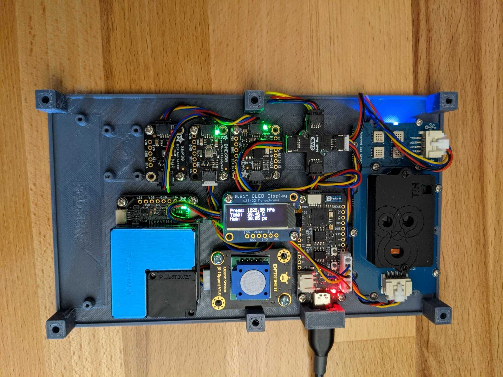
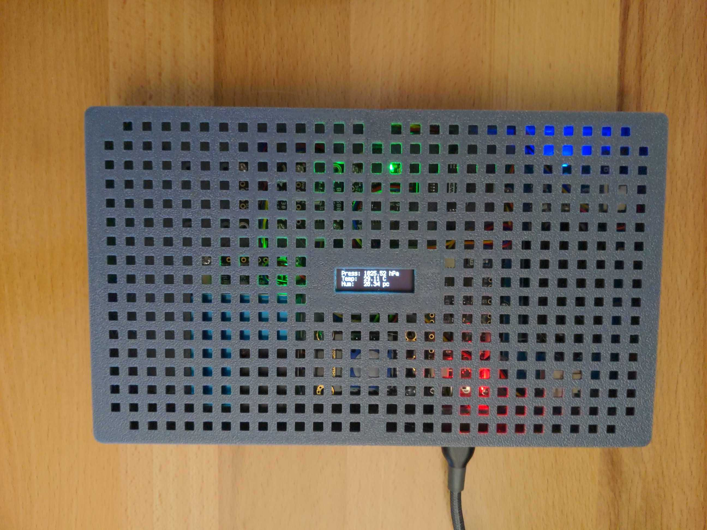

# aqi-monitor

This DIY air quality monitor will measure:

* temperature
* humidity
* pressure
* gas
* CO2
* number of particles
* ozone (expansion)
* earthquakes through an IMU (expansion)
* radioactivity (expansion)

There's an optional case and screen for both. The code is set up to allow you to only use a subset of sensors.

By default, results are uploaded periodically to [Freedom Robotics](freedomrobotics.ai) for easy inspection and alerting.

||
|---|---|

## BOM

If you want to encase the electronics, an STL file for 3D printing a case is in the [design folder](design/). 
Make sure you get the right case for either base or base+expansion set.

### Base set

| item | function | ~price | notes |
| [Adafruit FeatherS2 - ESP32-S2](https://www.adafruit.com/product/4769) | microcontroller | $22 | adafruit boards are often available on digikey and amazon if adafruit is sold out |
| [Adafruit BME680](https://www.adafruit.com/product/3660) |Temp/Humidity/Pressure/Gas| $19|incredibly sensitive pressure sensor, can possibly detect which floor of a building robot is on|
| [Adafruit PMSA003I](https://www.adafruit.com/product/4632) | PM1, PM2.5, PM10 particle sensor | $45 | this messes up the I2C bus it is placed on, thankfully ESP32-S2 has 2 I2C buses so this can have its own bus |
| [SeeedStudio SCD30](https://www.seeedstudio.com/Grove-CO2-Temperature-Humidity-Sensor-SCD30-p-2911.html) | CO2/temp/humidity sensor | $60 | NDIR CO2 sensor (much better than chemical); buy from Mouser for faster shipping to US destinations |
For a total of ~$146 excluding screen and case.

The STL files for 3D printing the base case can be found in the 

### Expansion set

These are extra sensors you can purchase in addition to the base set.
| item | function | ~price | notes |
| [Adafruit BNO085](https://github.com/adafruit/Adafruit_BNO08x) | IMU (Earthquake detection) | $20 | this is a really good IMU |
| [SeeedStudio Multichannel Gas Sensor v2](https://www.seeedstudio.com/Grove-Multichannel-Gas-Sensor-v2-p-4569.html) | CO, VOC, alcohol, NO2 | $35 | buy from Mouser for faster shipping to US destinations |
| [DFRobot I2C Ozone Sensor](https://www.dfrobot.com/product-2005.html) | ozone | $49 | buy from Mouser for faster shipping to US destinations |
| [Geiger Counter](https://www.ebay.com/itm/Arduino-dosimeter-module-Geiger-Counter-RadSens-Radiation-Detector-board-pcb/184495660379?ssPageName=STRK%3AMEBIDX%3AIT&_trksid=p2060353.m2763.l2649) | Radioactivity | $45 | ships from Russia; not yet tested; couldn't find a US-stocked I2C Geiger counter |

### Optional Screen

| item | function | ~price | notes |
| [Monochrome 0.91" 128x32 I2C OLED Display](https://www.adafruit.com/product/4440) | screen | $12.5 | optional |

## Instructions

### Wire the electronics

See pictures

### Modify the parameters

1. Download the [code](code/) and open `wifi.json`. Enter your Wifi name (SSID) and password. The microcontroller needs WiFi access to be able to upload the sensor data.
2. Create a new device on your FreedomRobotics account. When you get to the installation page, from the link that is shown, copy the `account`, `device`, `token`, and `secret` embedded in it into the `credentials.json` file. This lets the microcontroller send the sensor data to the Freedom API.
3. Open [code.py](code/code.py) and modify any of the parameters (`LOAD_XXX`) at the top to match your configuration. 

### Load on the code

Plug the microcontroller into your computer using a USB-C cable. It should appear in your file explorer. Copy and replace the files from the `code` folder including the files you modified into the `CIRCUITPY` folder.

Press reset. You should see data coming through in the Stream tab of FreedomRobotics.

## Troubleshooting

From a terminal window, you can log into the Feather S2 microcontroller to read the logs using

```
sudo screen /dev/ttyACM0 115200
```
The actual device name might be different. This opens up a python terminal. You can re-run the code by typing `import code`.
